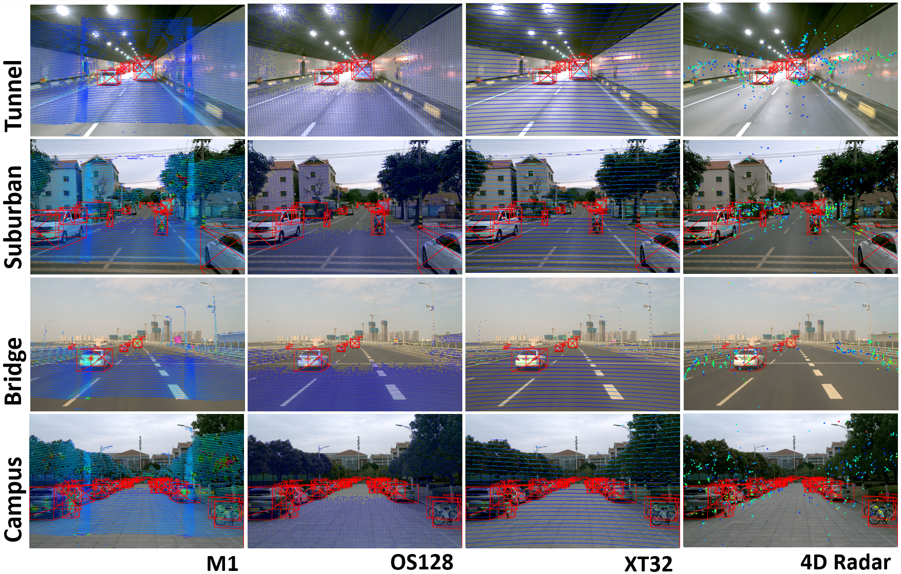

# CMD: A Cross Mechanism Domain Adaptation Dataset for 3D Object Detection(ECCV2024)

A dataset specifically designed for cross-mechanism domain adaptation, incorporating mechanical LiDARs with both high-res and low-res beams, solid-state LiDAR, and 4D millimeter-wave radar.


## Download
This is the official GitHub repository for CMD(xmuda) dataset.

1. The download links can be found in `(to update)`
2. We also support Baidu Yunpan. Link：[]() with extraction code: **** 

## Data Sample


## Get Started

### 1. Installation and Data Preparation
a. Clone this repository.
```shell
git clone https://github.com/wayyeah/CMD-xmuda.git
```
b. Create virtual-env.
```shell
conda create -n xmuda python=3.8
```
b.1 cuda-11.4、cuda-11.6、cuda-11.7 tested
```
conda activate xmuda
pip install torch==1.13.0+cu116 torchvision==0.14.0+cu116 torchaudio==0.13.0 --extra-index-url https://download.pytorch.org/whl/cu116
pip install spconv-cu116	
pip install -r requirements.txt
python setup.py develop
```
b.2 cuda-12.x not tested
```
conda activate xmuda
pip install torch==2.1.0 torchvision==0.16.0 torchaudio==2.1.0 --index-url https://download.pytorch.org/whl/cu121
pip install spconv-cu120
pip install -r requirements.txt
python setup.py develop
```
c.Download the dataset and run 

```
cat xmuda.tar.gz.part* > xmuda.tar.gz
tar -xzvf xmuda.tar.gz xmuda
ln -s /path/to/xmuda /xmuda/data/xmu
```
All the file will be organized as,
```
xmuda
├── data
│   ├── xmu
│   │   │── ImageSets
│   │   │── calib_to_ego
│   │   │── ImageSets
|   |   |── label_ego
|   |   |── seq**     
├── pcdet
├── tools
```


* Generate the data infos by running the following command: 
```python 
 python -m pcdet.datasets.xmu.xmu_dataset --func create_xmu_infos  --cfg_file tools/cfgs/dataset_configs/xmu/xmuda_dataset.yaml
```
* Generate gt_sampling_database by running the following command: 
```
python -m pcdet.datasets.xmu.xmu_dataset --func create_groundtruth_database  --cfg_file tools/cfgs/dataset_configs/xmu/xmu_dataset.yaml
```

# Due to our updated data annotation, the AP is different from what is presented in the paper
## Model Zoo 
### 3D Object Detection Baselines
Selected supported methods are shown in the below table. The results are the 3D detection performance on the val set of CMD dataset.
* All LiDAR-based models are trained with 4 GTX 3090 GPUs and are available for download. 

#### Ouster
|AP@50                                                        | Car|Truck |Pedestrian | Cyclist | mAP    |
| ------------------------------------------------------ | :-----: | :--------: | :----: |:----: |:----: |
| [PointPillar](tools/cfgs/xmu_ouster_models/pointpillar_1x.yaml) | 41.70   | 18.13      | 3.80   | 37.77  |25.35|
[CenterPoint](tools/cfgs/xmu_ouster_models/centerpoint.yaml)| 40.43|18.77|11.47|45.76|29.11| 
[Voxel-RCNN](tools/cfgs/xmu_ouster_models/voxel_rcnn.yaml)| 43.20   | 21.70      | 13.70   | 41.32  |29.98| 
[VoxelNeXt](tools/cfgs/xmu_ouster_models/voxelnext_ioubranch_large.yaml) | 41.40   | 20.98      | 10.25   | 46.14  |29.70 |


#### Robosense
|AP@50                                                        | Car|Truck |Pedestrian | Cyclist | mAP    |
| ------------------------------------------------------ | :-----: | :--------: | :----: |:----: |:----: |
| [PointPillar](tools/cfgs/xmu_robosense_models/pointpillar_1x.yaml) | 47.63   | 18.83      | 6.82   | 36.98  |27.56|
[CenterPoint](tools/cfgs/xmu_robosense_models/centerpoint.yaml)| 49.16|21.21|2.79|44.82|29.50| 
[Voxel-RCNN](tools/cfgs/xmu_robosense_models/voxel_rcnn.yaml)| 50.61   | 23.97      | 12.86   | 43.17  |32.65| 
[VoxelNeXt](tools/cfgs/xmu_robosense_models/voxelnext_ioubranch_large.yaml) | 49.56   | 21.66      | 5.64   | 44.45  |30.33 |


#### Hesai
|AP@50                                                        | Car|Truck |Pedestrian | Cyclist | mAP    |
| ------------------------------------------------------ | :-----: | :--------: | :----: |:----: |:----: |
| [PointPillar](tools/cfgs/xmu_hesai_models/pointpillar_1x.yaml) | 42.11   | 18.85      | 6.89   | 33.27  |25.28|
[CenterPoint](tools/cfgs/xmu_hesai_models/centerpoint.yaml)| 42.39|19.15|4.02|37.88|25.86| 
[Voxel-RCNN](tools/cfgs/xmu_hesai_models/voxel_rcnn.yaml)| 44.85   | 21.84      | 11.63   | 34.81  |28.28| 
[VoxelNeXt](tools/cfgs/xmu_hesai_models/voxelnext_ioubranch_large.yaml) | 44.19   | 21.57      | 3.66   | 39.47  |27.22 |


## Training
```
cd ../../tools
```
*if you use singe gpu run 
```
python train.py --cfg_file  cfgs/xmu_ouster_models/centerpoint.yaml 
```
*if you use multi 8 gpus run
```
bash scripts/dist_train.sh 8 --cfg_file cfgs/xmu_ouster_models/centerpoint.yaml 
```

## Evaluation
*if you use singe gpu run 
```
python test.py --cfg_file cfgs/xmu_ouster_models/centerpoint.yaml --ckpt /path/to/your/checkpoint 
```
*if you use multi 8 gpus run
```
bash scripts/dist_test.sh 8 --cfg_file cfgs/xmu_ouster_models/centerpoint.yaml --ckpt /path/to/your/checkpoint 
```


## Todo List
- [ ] Data of Radar.
- [ ] Code of Radar and Camera.
- [ ] Code of DIG.
- [ ] Code of BEVFUSION.


## Citation
If you find this dataset useful in your research, please consider cite:

```

```
